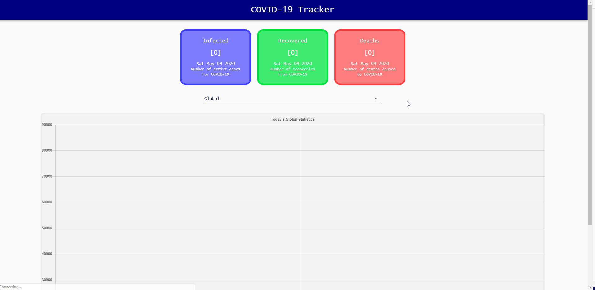

# COVID-19 Tracker
Coronavirus Tracker app created with Node.js and React



## Table of contents
* [General info](#general-info)
* [Technologies](#technologies)
* [Resources](#resources)
* [Setup](#setup)

## General info
This project uses a coronavirus statistics API to efficiently visualize significant paramaters such as cases, recoveries, and deaths for each country. In addition to this data, you can also view a timeline of daily cases and daily deaths for an easy interpretation of the historic activity of coronavirus infection rate.
	
## Technologies
Project is created with:
* Axios (0.19.2)
* Chart.js (2.9.3)
* Classnames (2.2.6)
* Material-UI (4.9.13)
* React (16.13.1)
* React-Countup (4.3.3)
* React-chartjs-2 (2.9.0)

## Resources
* [TheVirusTracker API](https://thevirustracker.com/api)
* [COVID Tracker Tutorial](https://youtu.be/khJlrj3Y6Ls)
	
## Setup
To run this project, install it locally using npm:

```
$ cd ../lorem
$ npm install
$ npm start
```